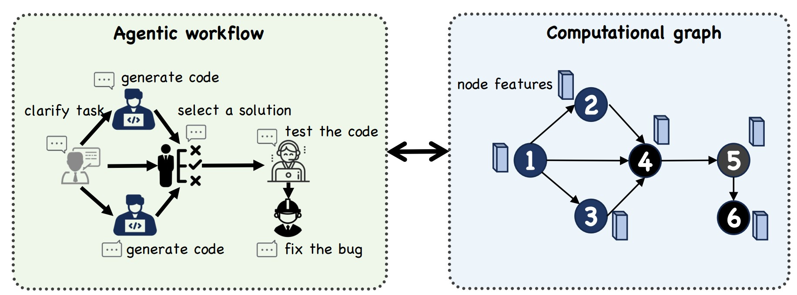

# [Arxiv 2025] Official code and datasets of paper: GNNs as Predictors of Agentic Workflow Performances


[](https://arxiv.org/abs/2503.11301) [](https://huggingface.co/datasets/YuanshuoZhang/FLORA-Bench)


## 📢 News
2025.3.14: 📄 We release the [preprint](https://arxiv.org/pdf/2503.11301).


2023.6.27: 📊 You can access our dataset in [huggingface](https://huggingface.co/datasets/YuanshuoZhang/FLORA-Bench)

## 🚀 Getting Started

### 0. ⚙️ Environment Setup
To set up the environment, you can use the provided `environment.yml` file to create a conda environment with all the necessary dependencies. Run the following command:

```bash
conda env create -f environment.yml --name flora_bench
conda activate flora_bench
```

### 1. 🛠️ Download Data and Checkpoints

For the dataset used to train GNNs, you can download via [huggingface](https://huggingface.co/datasets/YuanshuoZhang/FLORA-Bench). 

For GNN check point, 

Additionally, we should download the data used for [AFLOW](https://github.com/FoundationAgents/MetaGPT/tree/main/metagpt/ext/aflow)

You can download the necessary data, including the initial graph, dataset, and GNNs checkpoints. You can do this by running the following command:

```bash
python data/download_data.py
```

Alternatively, you can download the data from the following Google Drive URL:

This will download the following:
- Initial round data
- Dataset
- GNNs checkpoints
- Results
### 3.


### 2. Run Workflow Generation with GNN as Reward Model

To optimize the agentic workflows using GNN as the reward model integrated with Monte Carlo Tree Search (MCTS), run the following example script:

```bash
source scripts/optimize/run_generate_workflow.sh
```

### Parameters:
- `--is_first_optimized`: Set this flag if it's the first time you're running the optimization. This will ensure that the necessary data is downloaded.
- `--dataset`: Specify the dataset to use for optimization. Available options are `HumanEval`, `MBPP`, `MMLU`, `MATH`, and `GSM8K`.

## 3. Generate Actual Inference Labels from Optimized Workflows

After generating the optimized workflows, you can compare the actual inference scores with the predicted scores by running the following script:

```bash
source scripts/optimize/run_generate_labels.sh
```

### Parameters:
- `--dataset`: Specify the dataset used for optimization.
- `--dataset_file`: Path to the dataset file (e.g., `data/humaneval_test.jsonl`).
- `--workflow_dir`: Directory containing the optimized workflows (e.g., `workplace/HumanEval/workflows`).
- `--labels_dir`: Directory to save the generated labels (e.g., `workplace/HumanEval/labels`).
- `--llm_config`: Specify the LLM configuration (e.g., `gpt-4o-mini`).


